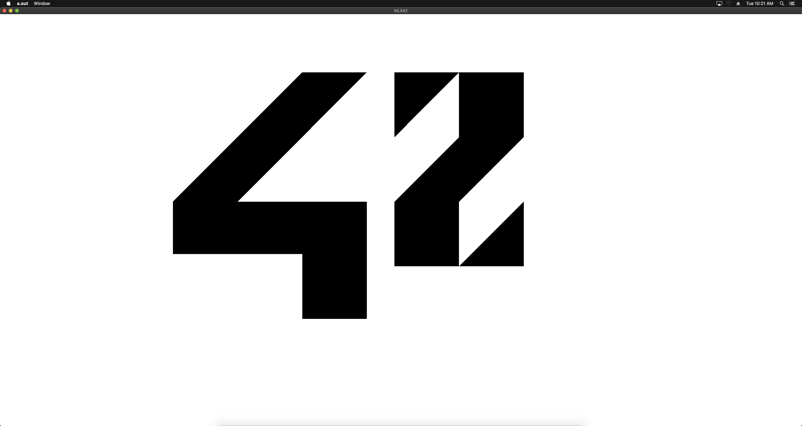

<!----------------------------------------------------------------------------
Copyright @ 2021-2022 Codam Coding College. All rights reserved.
See copyright and license notice in the root project for more information.
----------------------------------------------------------------------------->

# XPM42

XPM42 is a custom file format made for MLX42 to provide a easy to use and understand image file format to learn how 
images can be stored. The format is based on the actual [XPM3](https://en.wikipedia.org/wiki/X_PixMap) format.

A XPM file basically stores a look-up table inside of it to fetch which character corresponds to which color. Additionally in the
header there is a character per pixel count, this is due to the limitation of the amount of characters. Each 'Pixel' in the XPM data can 
be represented by multiple characters.

For example `*.` would be viewed as a single pixel if the characters per pixel count was 2.

## Layout

The file format looks as follows:

```
!XPM42            <- File declaration
16 7 2 1 c        <- Width | Height | Color count | Characters per Pixel | Mode (C: Color or M: Monochrome)
* #FF0000FF       <- Entry always: <Char> <Space> <Hexadecimal> Colors MUST have all four channels (RGBA)
. #00000000
**..*...........  <- Literal pixel data
*.*.*...........
**..*..**.**..**
*.*.*.*.*.*..*.*
**..*..**.*...**
...............*
.............**.
```

## Inner workings

Reading a XPM42 does a whole bunch of stuff but in essence it reads the file header and inserts each color entry into a hash table for fast lookups of the color value, the hash used is FNV-1a. Why, because it's an easy to use hash and also my favourite. After the header is read and the color values are inserted into the table each line is then read and each character is processed and inserted into the pixel buffer of the XPM. There is no collision checking for the look-up table, so artefacts may be present.

## Tools

In the root of the repository is a tools directory in which a python script can convert an existing XPM3 file to XPM42.
Use this script if you wish to use the XPM42 file format.

## Example

```C
#include <stdio.h>
#include <unistd.h>
#include <stdlib.h>
#include "MLX42/MLX42.h"
#define WIDTH 5120
#define HEIGHT 2880

static void error(void)
{
	puts(mlx_strerror(mlx_errno));
	exit(EXIT_FAILURE);
}

int32_t	main(void)
{
	// Start mlx
	mlx_t* mlx = mlx_init(WIDTH, HEIGHT, "Test", true);
	if (!mlx)
        error();

	// Try to load the file
	xpm_t* xpm = mlx_load_xpm42("./temp/42.xpm42");
	if (!xpm)
        error();
	
	// Convert texture to a displayable image
	mlx_image_t* img = mlx_texture_to_image(mlx, &xpm->texture);
	if (!img)
        error();

	// Display the image
	if (mlx_image_to_window(mlx, img, 0, 0) < 0)
        error();

	mlx_loop(mlx);

	// Optional, terminate will clean up any left overs, this is just to demonstrate.
	mlx_delete_image(mlx, img);
	mlx_delete_xpm42(xpm);
	mlx_terminate(mlx);
	return (EXIT_SUCCESS);
}
```



