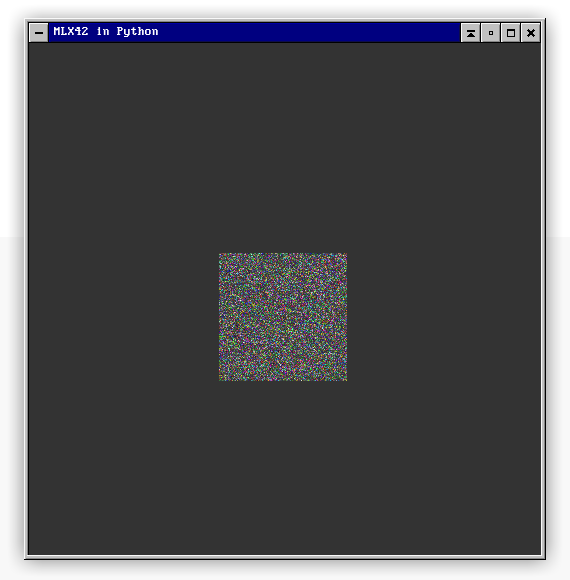

# Python Bindings for MLX42

This directory contains Python bindings for the MLX42 graphics library, allowing you to use MLX42 functionalities in Python applications (using ^=3.13).

## Building

```bash
git clone https://github.com/codam-coding-college/MLX42.git
cd MLX42
cmake -B build -DBUILD_SHARED_LIBS=ON && cmake --build build --parallel
```

Within MLX42's root directory, there is an example script located at `ffi/python/example.py`.
You can run this script to see how to use the Python bindings:

In case you have a static library (`libmlx42.a`), you can create a shared library from it using `clang` or `gcc`:
```bash
clang -shared -o libmlx42.so libmlx42.a
```

Afterwards, place the shared library in the `ffi/python/` directory:
```bash
# You can also move the shared library onto a system path
mv build/libmlx42.so ffi/python/libmlx42.so
cd ffi/python
python3 example.py
```

# Example Output
